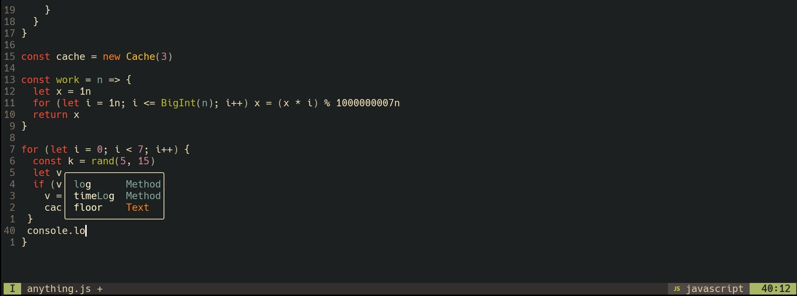

# Zenvim: Neovim for Termux

<p align="center">
  
</p>

<p align="center">
  <a href="https://opensource.org/licenses/MIT"></a>
  <a href="https://github.com/nurmuhammedjoy/zenvim"></a>
  <a href="https://termux.dev/"></a>
  <a href="https://neovim.io/"></a>
</p>

<p align="center">
  <em>A powerful, lightweight, and modular Neovim configuration optimized for coding on Android via Termux.</em>
</p>

---

##  Introduction

A powerful yet lightweight Neovim configuration optimized for coding on Termux


###  Key Features

- **Performance Optimized**: Fast startup time with lazy-loading plugins.
- **Modern Package Management**: Powered by [`lazy.nvim`](https://github.com/folke/lazy.nvim) for automatic updates and management.
- **Intelligent Coding**: 
  - Full **LSP** support (HTML, CSS, TS, JSON, Emmet) via [`mason.nvim`](https://github.com/williamboman/mason.nvim).
  - Autocompletion with [`nvim-cmp`](https://github.com/hrsh7th/nvim-cmp).
  - AI assistance with **GitHub Copilot**.
- **Beautiful UI**: Gruvbox theme (transparent), custom dashboard, and sleek [`lualine`](https://github.com/nvim-lualine/lualine.nvim).
- **Enhanced Navigation**: 
  - [`nvim-tree`](https://github.com/nvim-tree/nvim-tree.lua) for file management.
  - [`telescope`](https://github.com/nvim-telescope/telescope.nvim) for fuzzy finding.
- **Termux Friendly**: Keybindings designed for touch keyboards and mobile constraints.

---

## Preview

<p align="center">
  
  <br>
  <!-- Replace video.mp4 with a relative link if available in the repo -->
  <!-- <video controls width="600"><source src="video.mp4" type="video/mp4"></video> -->
</p>

---

##  Installation

### Prerequisites
- **Termux** app installed on Android.
- **Neovim** (v0.9.0 or newer).
- **Git** and **Curl**.

### Automatic Install
Run this single command in Termux to back up your old config and install Zenvim:

```bash
curl -fsSL https://raw.githubusercontent.com/nurmuhammedjoy/zenvim/main/build | sh
```

### Manual Install
If you prefer to install manually:

1. **Backup existing config:**
   ```bash
   mv ~/.config/nvim ~/.config/nvim.bak
   ```
2. **Clone the repository:**
   ```bash
   git clone https://github.com/nurmuhammedjoy/zenvim.git
   ```
3. **Move configuration files:**
   ```bash
   mkdir -p ~/.config/nvim
   cp -r zenvim/config/* ~/.config/nvim/
   ```
4. **Clean up:**
   ```bash
   rm -rf zenvim
   ```

---

##  Key Bindings

**Leader Key:** <kbd>Space</kbd>

###  General & File Management

| Key | Mode | Action |
| :--- | :---: | :--- |
| <kbd>Ctrl</kbd> + <kbd>s</kbd> | `n/i` | Save file |
| <kbd>Ctrl</kbd> + <kbd>q</kbd> | `n/i` | Quit Neovim |
| <kbd>Ctrl</kbd> + <kbd>e</kbd> | `n` | Toggle File Explorer (NvimTree) |
| <kbd>Space</kbd> + <kbd>nh</kbd> | `n` | Clear search highlights |
| <kbd>Space</kbd> + <kbd>bn</kbd> | `n` | Next Buffer |
| <kbd>Space</kbd> + <kbd>bp</kbd> | `n` | Previous Buffer |
| <kbd>Ctrl</kbd> + <kbd>\</kbd> | `n/t` | Toggle Terminal |

###  Search (Telescope)

| Key | Action |
| :--- | :--- |
| <kbd>Space</kbd> + <kbd>ff</kbd> | Find files |
| <kbd>Space</kbd> + <kbd>fg</kbd> | Live Grep (search text in files) |
| <kbd>Space</kbd> + <kbd>fb</kbd> | Find open buffers |
| <kbd>Space</kbd> + <kbd>fo</kbd> | Recent files (Oldfiles) |

###  LSP & Coding

| Key | Action |
| :--- | :--- |
| <kbd>gd</kbd> | Go to Definition |
| <kbd>gr</kbd> | Go to References |
| <kbd>K</kbd> | Show Hover Documentation |
| <kbd>Space</kbd> + <kbd>rn</kbd> | Rename Symbol |
| <kbd>Space</kbd> + <kbd>ca</kbd> | Code Actions |
| <kbd>Space</kbd> + <kbd>f</kbd> | Format File |
| <kbd>Space</kbd> + <kbd>r</kbd> | Search & Replace (Confirm) |
| <kbd>Space</kbd> + <kbd>R</kbd> | Search & Replace (All) |

###  GitHub Copilot

| Key | Mode | Action |
| :--- | :---: | :--- |
| <kbd>Ctrl</kbd> + <kbd>g</kbd> | `i` | Accept Suggestion |
| <kbd>Ctrl</kbd> + <kbd>\</kbd> | `i` | Dismiss Suggestion |

###  Line Moving

| Key | Action |
| :--- | :--- |
| <kbd>Ctrl</kbd> + <kbd>⬆️⬇️</kbd> | Move line up/down |
| <kbd>Ctrl</kbd> + <kbd>⬅️➡️</kbd> | Move selection left/right |

---

##  Included Plugins

Zenvim comes pre-configured with these essential plugins:

- **Core**: `lazy.nvim`, `plenary.nvim`
- **UI**: `gruvbox.nvim` (Theme), `lualine.nvim` (Status), `alpha-nvim` (Dashboard), `nvim-web-devicons`
- **Editor**: `nvim-tree.lua` (Explorer), `telescope.nvim` (Finder), `nvim-treesitter` (Syntax), `mini.move` (Line moving), `nvim-surround`
- **LSP & Completion**: `nvim-lspconfig`, `mason.nvim`, `nvim-cmp`, `LuaSnip`
- **Tools**: `copilot.vim` (AI), `toggleterm.nvim` (Terminal)

---

##  Contributing

Contributions are welcome! If you find a bug or want to add a feature, feel free to open an issue or submit a pull request.

1. Fork the repository
2. Create your feature branch (`git checkout -b feature/AmazingFeature`)
3. Commit your changes (`git commit -m 'Add some AmazingFeature'`)
4. Push to the branch (`git push origin feature/AmazingFeature`)
5. Open a Pull Request

---

<p align="center">
  Made with ❤️ by <strong>nurmuhammedjoy</strong>
</p>
