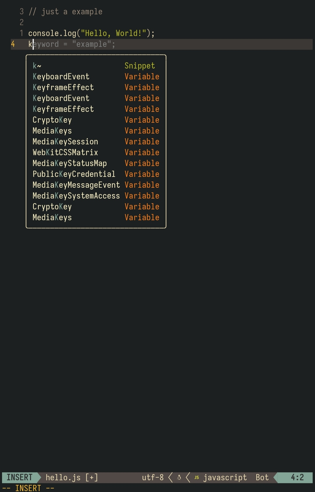

# Neovim Configuration for Termux

<p align="center">
  
</p>

<p align="center">
  <a href="https://opensource.org/licenses/MIT"></a>
  <a href="https://github.com/nurmuhammedjoy/zenvim"></a>
  <a href="https://termux.dev/"></a>
  <a href="https://neovim.io/"></a>
</p>

<p align="center">
  <em> A powerful yet lightweight Neovim configuration optimized for coding on Android </em>
</p>

## Preview 

<p align="center">
  
</p>


## Features

-  **Gorgeous UI** with Gruvbox theme and transparent background
-  **Intuitive File Navigation** with Neo-tree explorer  
-  **Powerful Search** with Telescope fuzzy finder
-  **Intelligent Code Assistance** with LSP and nvim-cmp
-  **AI Coding Partner** with GitHub Copilot integration
-  **Lightning Fast** with performance optimizations for mobile
-  **Touch-Friendly** key mappings designed for Termux
-  **Preconfigured** for web development

---

## Requirements

- **Neovim 0.9** or later
- **Unexpected Keyboard** but optional 

---

##  Quick Installation

```bash

```

---

##  Key Bindings

> **Note:** The leader key is set to <kbd>Space</kbd>

### General

| Key Combination | Mode | Action |
|:---------------:|:----:|--------|
| <kbd>Ctrl</kbd> + <kbd>s</kbd> | Normal/Insert | Save file        |
| <kbd>Space</kbd> + <kbd>nh</kbd> | Normal | Clear search highlights.            |

### File Explorer (Neo-tree)

| Key Combination | Mode | Action |
|:---------------:|:----:|--------|
| <kbd>Space</kbd> + <kbd>e</kbd> | Normal | Toggle file explorer |

### Fuzzy Finder (Telescope)

| Key Combination | Mode | Action |
|:---------------:|:----:|--------|
| <kbd>Space</kbd> + <kbd>ff</kbd> | Normal | Find files |
| <kbd>Space</kbd> + <kbd>fg</kbd> | Normal | Live grep (search in files) |
| <kbd>Space</kbd> + <kbd>fb</kbd> | Normal | Browse buffers |

### LSP Features

| Key Combination | Mode | Action |
|:---------------:|:----:|--------|
| <kbd>gd</kbd> | Normal | Go to definition |
| <kbd>gr</kbd> | Normal | Find references |
| <kbd>K</kbd> | Normal | Show hover documentation |
| <kbd>Space</kbd> + <kbd>rn</kbd> | Normal | Rename symbol |
| <kbd>Space</kbd> + <kbd>ca</kbd> | Normal | Code actions |
| <kbd>Space</kbd> + <kbd>f</kbd> | Normal | Format file |

### GitHub Copilot

| Key Combination | Mode | Action |
|:---------------:|:----:|--------|
| <kbd>Ctrl</kbd> + <kbd>g</kbd> | Insert | Accept suggestion |
| <kbd>Ctrl</kbd> + <kbd>\</kbd> | Insert | Dismiss suggestion |

### Buffer Navigation

| Key Combination | Mode | Action |
|:---------------:|:----:|--------|
| <kbd>Space</kbd> + <kbd>bn</kbd> | Normal | Next buffer |
| <kbd>Space</kbd> + <kbd>bp</kbd> | Normal | Previous buffer |

---

## Some basic Neovim shortcut

### Modes
- **Normal Mode**: Navigation and commands (default)
- **Insert Mode**: Typing text (press <kbd>i</kbd> to enter)
- **Visual Mode**: Selecting text (press <kbd>v</kbd> to enter)

### Essential Commands
- **Save**: <kbd>:</kbd><kbd>w</kbd><kbd>Enter</kbd> in Normal mode
- **Quit**: <kbd>:</kbd><kbd>q</kbd><kbd>Enter</kbd> in Normal mode
- **Force Quit**: <kbd>:</kbd><kbd>q</kbd><kbd>!</kbd><kbd>Enter</kbd> in Normal mode
- **Save & Quit**: <kbd>:</kbd><kbd>w</kbd><kbd>q</kbd><kbd>Enter</kbd> in Normal mode

### Navigation (Normal Mode)
- <kbd>h</kbd><kbd>j</kbd><kbd>k</kbd><kbd>l</kbd>: Move cursor left/down/up/right
- <kbd>w</kbd>: Move to next word
- <kbd>b</kbd>: Move to previous word
- <kbd>0</kbd>: Move to start of line
- <kbd>$</kbd>: Move to end of line
- <kbd>gg</kbd>: Go to top of file
- <kbd>G</kbd>: Go to end of file

### Editing (Normal Mode)
- <kbd>i</kbd>: Enter Insert mode
- <kbd>a</kbd>: Enter Insert mode after cursor
- <kbd>o</kbd>: Open new line below and enter Insert mode
- <kbd>dd</kbd>: Delete line
- <kbd>yy</kbd>: Copy (yank) line
- <kbd>p</kbd>: Paste after cursor
- <kbd>u</kbd>: Undo
- <kbd>Ctrl</kbd> + <kbd>r</kbd>: Redo

---

## Included Plugins

| Plugin | Description |
|:-------|:------------|
| **[lazy.nvim](https://github.com/folke/lazy.nvim)** | Modern plugin manager |
| **[gruvbox.nvim](https://github.com/ellisonleao/gruvbox.nvim)** | Beautiful color scheme |
| **[neo-tree.nvim](https://github.com/nvim-neo-tree/neo-tree.nvim)** | File explorer with git integration |
| **[telescope.nvim](https://github.com/nvim-telescope/telescope.nvim)** | Fuzzy finder and searcher |
| **[copilot.vim](https://github.com/github/copilot.vim)** | GitHub Copilot AI integration |
| **[nvim-lspconfig](https://github.com/neovim/nvim-lspconfig)** | Language server configuration |
| **[mason.nvim](https://github.com/williamboman/mason.nvim)** | Package manager for LSP servers |
| **[nvim-cmp](https://github.com/hrsh7th/nvim-cmp)** | Intelligent completion engine |
| **[lualine.nvim](https://github.com/nvim-lualine/lualine.nvim)** | Sleek status line |
| **[nvim-autopairs](https://github.com/windwp/nvim-autopairs)** | Automatic bracket pairs |
| **[Comment.nvim](https://github.com/numToStr/Comment.nvim)** | Smart code commenting |

---

## Mobile Optimizations

### Performance Tweaks
-  Disabled unused providers (Ruby, Perl, Python)
-  Reduced update times for better responsiveness
-  Lazy-loaded plugins to improve startup time
-  Limited UI elements to save screen space

---

## Support & Contribute

### Star this repo
If you find this configuration useful, please consider giving it a star!

[](https://github.com/nurmuhammedjoy/zenvim)

### Report issues
Found a bug or have a feature request? 

[Open an issue](https://github.com/nurmuhammedjoy/zenvim/issues/new)

---
